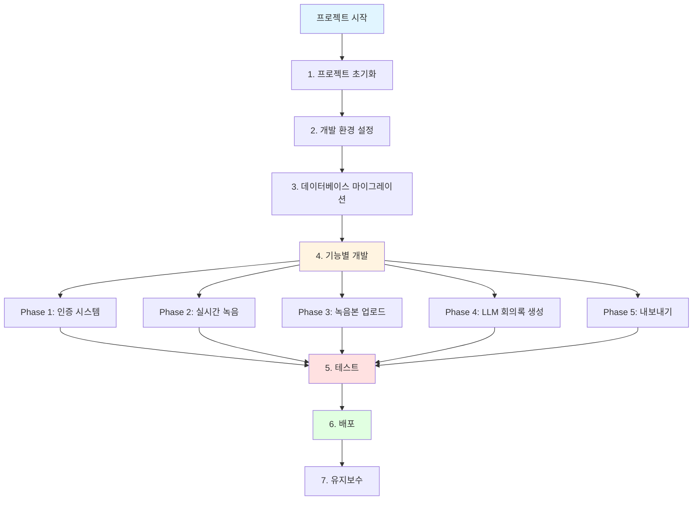
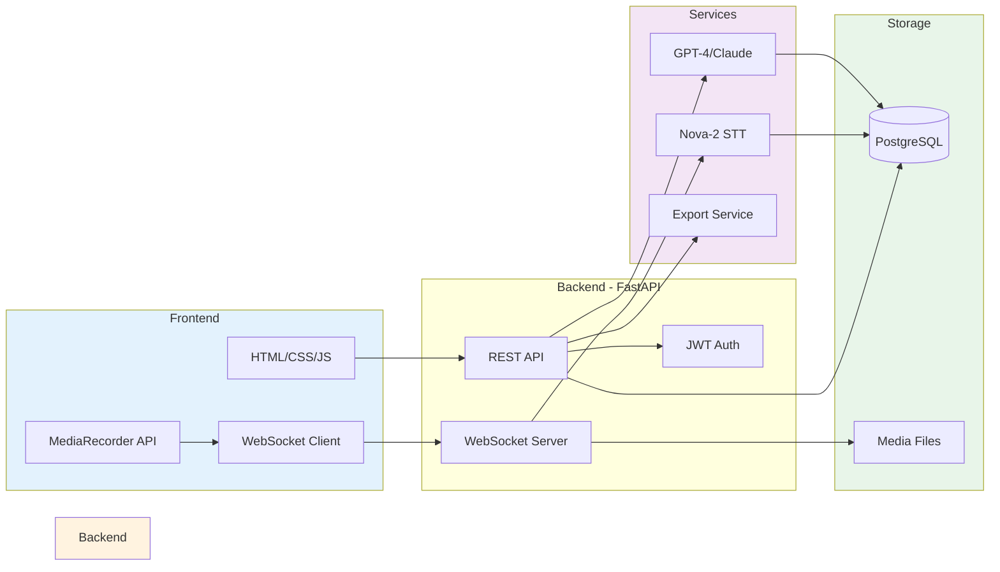
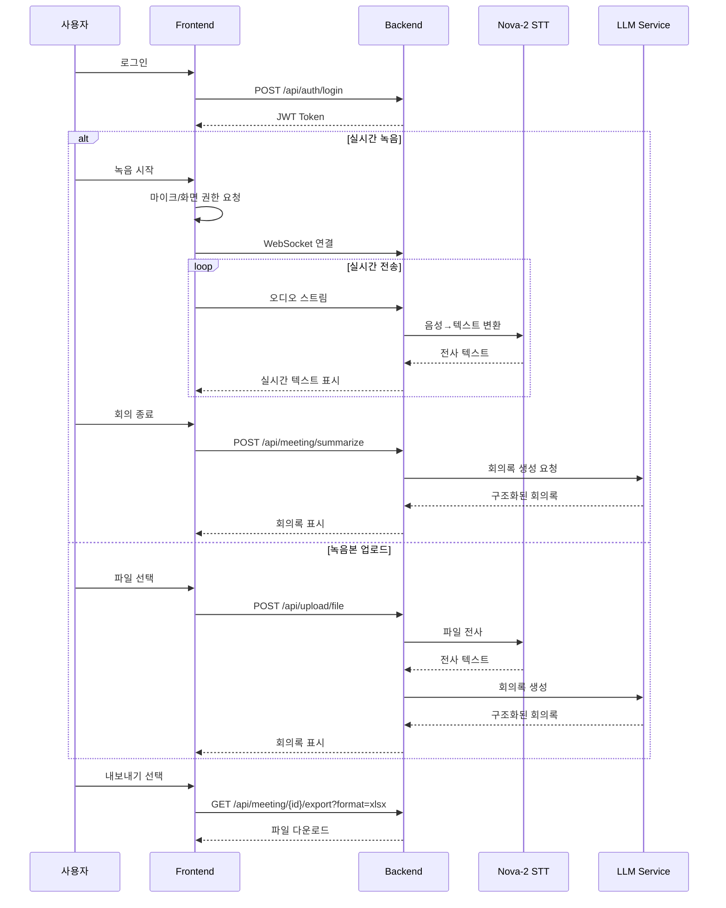

# LiveMeeting (LM) 프로젝트 워크플로우

## 🎯 전체 개발 플로우



## 🏗️ 시스템 아키텍처



## 📊 사용자 플로우



## 1. 프로젝트 초기화

### 1.1 디렉토리 구조 생성
```bash
mkdir -p backend/app/{api,core,db,models,schemas,services,utils}
mkdir -p backend/app/api/endpoints
mkdir -p frontend/{static/{css,js},templates}
mkdir -p media/{recordings,transcripts}
mkdir -p exports
```

### 1.2 필수 파일 생성
- `backend/requirements.txt`: Python 의존성
- `backend/Dockerfile`: Backend 컨테이너 이미지
- `frontend/Dockerfile`: Frontend 컨테이너 이미지 (선택)
- `docker-compose.yml`: 전체 서비스 오케스트레이션
- `.env`: 환경 변수 (AWS 자격 증명, DB 설정 등)

## 2. 개발 환경 설정

### 2.1 환경 변수 설정 (.env)
```env
# Database
POSTGRES_USER=lm_user
POSTGRES_PASSWORD=secure_password
POSTGRES_DB=live_meeting
DATABASE_URL=postgresql://lm_user:secure_password@db:5432/live_meeting

# AWS Credentials (Nova-2 STT)
AWS_ACCESS_KEY_ID=your_access_key
AWS_SECRET_ACCESS_KEY=your_secret_key
AWS_REGION=us-east-1

# LLM API (OpenAI/Anthropic)
OPENAI_API_KEY=your_openai_key
# or
ANTHROPIC_API_KEY=your_anthropic_key

# Application
SECRET_KEY=your_secret_key_for_jwt
ALGORITHM=HS256
ACCESS_TOKEN_EXPIRE_MINUTES=30
```

### 2.2 Docker Compose 실행
```bash
docker-compose up --build
```

## 3. 데이터베이스 마이그레이션

### 3.1 Alembic 초기화 (최초 1회)
```bash
docker-compose exec backend alembic init alembic
```

### 3.2 마이그레이션 파일 생성
```bash
docker-compose exec backend alembic revision --autogenerate -m "Initial migration"
```

### 3.3 마이그레이션 실행
```bash
docker-compose exec backend alembic upgrade head
```

## 4. 기능별 개발 순서

### Phase 1: 인증 시스템
1. User 모델 생성 (`models/user.py`)
2. 회원가입 API (`api/endpoints/auth.py`)
3. 로그인 API (JWT 토큰 발급)
4. 로그인 페이지 UI

### Phase 2: 실시간 녹음 기능
1. WebSocket 엔드포인트 설정 (`api/endpoints/recording.py`)
2. Nova-2 STT 서비스 구현 (`services/stt_service.py`)
3. 마이크 권한 요청 (Frontend JavaScript)
4. 화면 녹화 권한 요청 (MediaRecorder API)
5. 실시간 오디오 스트리밍 → STT 변환
6. 텍스트 축적 (DB 또는 메모리)

### Phase 3: 녹음본 업로드 기능
1. 파일 업로드 API (`api/endpoints/upload.py`)
2. 지원 포맷: mp3, wav, m4a, mp4, webm
3. 파일 → Nova-2 STT 변환
4. 전사(Transcription) 텍스트 저장

### Phase 4: LLM 회의록 생성
1. LLM 서비스 구현 (`services/llm_service.py`)
2. 중간 요약 기능 (5분마다 또는 사용자 요청 시)
3. 최종 회의록 생성 (회의 종료 시)
4. 회의록 템플릿:
   - 날짜/시간
   - 참석자 (옵션)
   - 주요 안건
   - 논의 사항
   - 결정 사항
   - 액션 아이템

### Phase 5: 내보내기 기능
1. CSV 생성 (`services/export_service.py`)
2. XLSX 생성 (openpyxl 사용)
3. 저장 경로 선택 (브라우저 다운로드)
4. 다운로드 API

## 5. 테스트

### 5.1 단위 테스트
```bash
docker-compose exec backend pytest tests/
```

### 5.2 API 테스트 (Postman/Insomnia)
- 회원가입: POST `/api/auth/register`
- 로그인: POST `/api/auth/login`
- 녹음 시작: WebSocket `/ws/recording`
- 파일 업로드: POST `/api/upload/file`
- 회의록 생성: POST `/api/meeting/{id}/summarize`
- 내보내기: GET `/api/meeting/{id}/export?format=xlsx`

### 5.3 통합 테스트
1. 로그인 → 실시간 녹음 → 회의록 생성 → 내보내기 (전체 플로우)
2. 로그인 → 파일 업로드 → 회의록 생성 → 내보내기

## 6. 배포

### 6.1 프로덕션 빌드
```bash
docker-compose -f docker-compose.prod.yml up -d
```

### 6.2 로그 확인
```bash
docker-compose logs -f backend
```

### 6.3 백업
```bash
docker-compose exec db pg_dump -U lm_user live_meeting > backup.sql
```

## 7. 유지보수

### 7.1 DB 마이그레이션 추가
```bash
docker-compose exec backend alembic revision --autogenerate -m "Description"
docker-compose exec backend alembic upgrade head
```

### 7.2 의존성 업데이트
```bash
docker-compose exec backend pip install --upgrade -r requirements.txt
```

### 7.3 컨테이너 재시작
```bash
docker-compose restart backend
```
