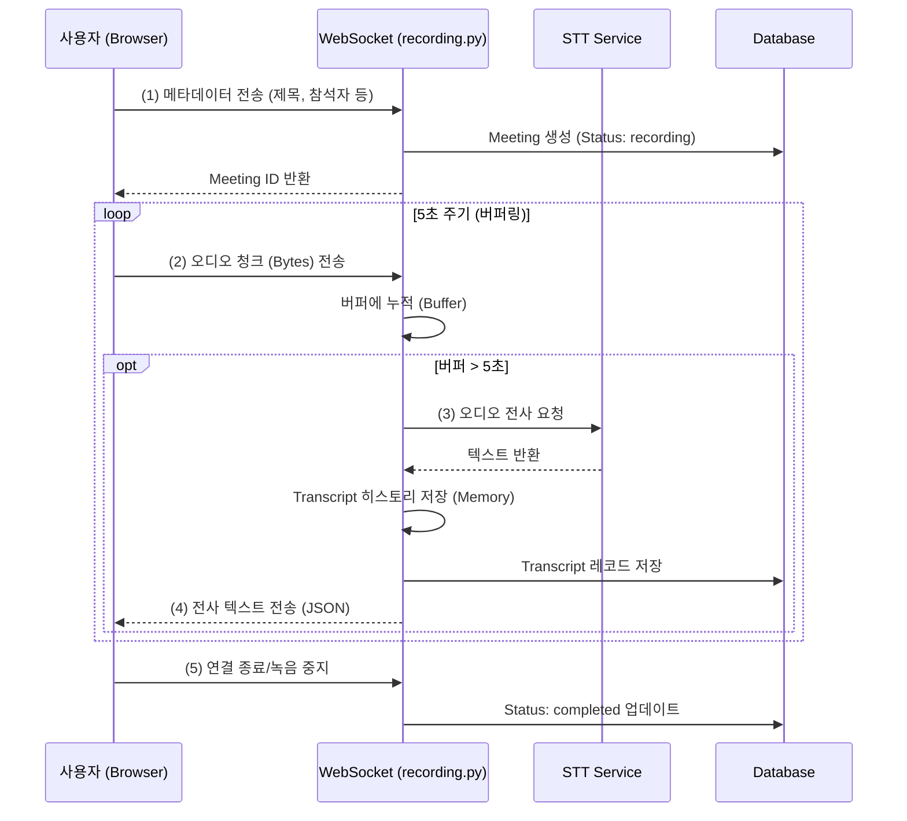
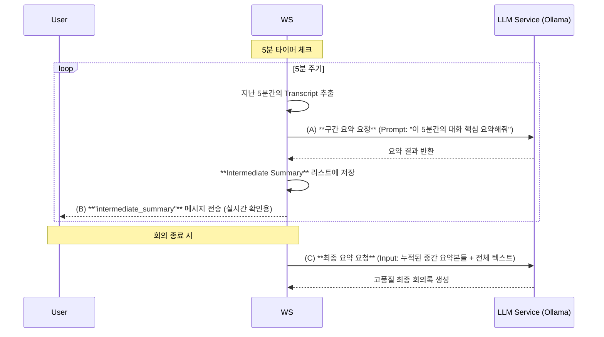

# 실시간 회의 중간 요약 기능 설계

## 1. 현재 실시간 녹음/전사 흐름 (Current Flow)

현재 [recording.py](file:///c:/big20/live_meeting/backend/app/api/endpoints/recording.py) (WebSocket)와 [recording.js](file:///c:/big20/live_meeting/frontend/static/js/recording.js) (Frontend)는 다음과 같이 동작합니다.

---

## 2. 중간 요약 기능 추가 설계 (Proposed Architecture: Periodic Auto-Summary)

사용자의 요청에 따라 **5분 단위로 자동으로 중간 요약을 생성**하는 방식으로 변경합니다. 
이는 긴 회의의 경우 마지막에 한 번에 요약하는 것보다, 중간중간 요약해둔 내용을 바탕으로 최종 정리(Map-Reduce 방식)를 할 때 **품질과 정확도가 훨씬 높아지는 장점**이 있습니다.

### 변경된 흐름

## 3. 구현 위치 상세 (Code Changes)

### 1) Backend ([app/api/endpoints/recording.py](file:///c:/big20/live_meeting/backend/app/api/endpoints/recording.py))
- **Timer Logic**: [RealtimeSession](file:///c:/big20/live_meeting/backend/app/api/endpoints/recording.py#18-49)에 `last_summary_time` 변수 추가
- **Trigger**: 오디오 청크 처리 루프에서 `current_time - last_summary_time >= 300초(5분)` 체크
- **Action**: 
    1. 최근 5분간의 전사 텍스트(`transcript_history`의 slice) 추출
    2. `llm_service.generate_simple_summary` 호출
    3. 결과 저장 및 클라이언트로 전송

### 2) Frontend ([recording.js](file:///c:/big20/live_meeting/frontend/static/js/recording.js))
- **UI**: "중간 요약" 버튼 삭제 (자동화됨)
- **Display**: 우측 사이드바나 하단에 "타임라인/중간요약" 탭을 만들어, 5분마다 생성된 요약 카드가 쌓이도록 구현

### 3) LLM Service ([app/services/llm_service.py](file:///c:/big20/live_meeting/backend/app/services/llm_service.py))
- **Context Management**: 5분 단위 요약은 짧은 텍스트(약 1000~2000자)이므로 빠르고 정확함.
- **Improved Final Summary**: [process_meeting_summary](file:///c:/big20/live_meeting/backend/app/services/meeting_tasks.py#7-104)가 이제 전체 텍스트만 보는 게 아니라, **"중간 요약본들"을 참고자료로 활용**할 수 있어 긴 회의도 놓치는 내용 없이 완벽하게 정리 가능.

---
이 설계대로 구현하면 실시간 회의 중 언제든지 현재까지의 진행 상황을 요약해서 볼 수 있습니다.
